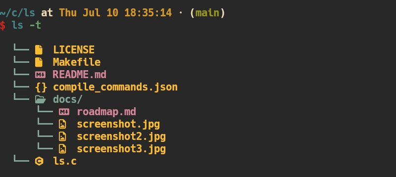

# ls [](https://img.shields.io/badge/tag-v0.0.4-green)


An alternative to ls command, Pure C language implementation

## Screenshots




## Usage

First, clone this repo and run:

```bash
make
```

*Tips: Make sure `.local/bin` is in your PATH variable*

Then, you can run the command:

```bash
ls
# or with options
ls -l
ls -a
ls -t
ls -l -a
```

## Contributing

If you want to contribute, feel free to open an issue or a pull request. Any contributions are welcome!

More features will be added in the future.
