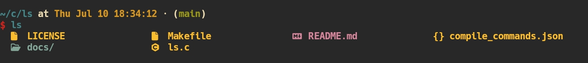
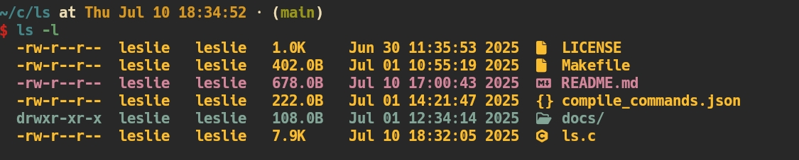

# ls [](https://img.shields.io/badge/tag-v0.0.9-green)

A fast, lightweight alternative to the standard `ls` command, implemented in pure C.

## Features

- **Fast**: Optimized for speed with minimal memory footprint
- **Compatible**: Supports common `ls` flags and behaviors
- **Clean**: Simple, readable output formatting
- **Portable**: Works across different Unix-like systems

## Screenshots

### Basic Listing


### Detailed View


### With Tree View


## Installation

### Prerequisites
- C compiler (gcc/clang)
- make

### Build from Source

```bash
git clone git@github.com:here-Leslie-Lau/ls.git
cd ls
make
```

*Ensure `~/.local/bin` is in your PATH*

## Usage

### Basic Commands
```bash
ls                    # List files in current directory
ls -l                 # Long format with permissions, size, and dates
ls -a                 # Show hidden files (starting with .)
ls -t                 # Show files in tree structure
ls -l -a              # Combine flags: long format with hidden files
...
```

### Supported Flags
- `-l`: Long format
- `-a`: Show all files (including hidden)
- `-t`: Show files in tree structure

## Contributing

Contributions are welcome! Please feel free to:
- Report bugs via [Issues](https://github.com/here-Leslie-Lau/ls/issues)
- Submit [Pull Requests](https://github.com/here-Leslie-Lau/ls/pulls)
- Suggest new features or improvements

### Development Setup
1. Fork the repository
2. Create a feature branch
3. Make your changes
4. Test thoroughly
5. Submit a pull request

## License

This project is open source. See the LICENSE file for details.

---

*Version 0.0.9 - More features coming soon!*
